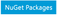

---
MSHAttr:
- 'DocSet:guide-Prism-201403'
- 'AssetID:6a56f3bb-c9a7-4aac-9bb6-32ee64722c84'
- 'DocSetTitle:p and p Landing Pages'
MSHKeywordA: '6a56f3bb-c9a7-4aac-9bb6-32ee64722c84'
ms.shortidmsdn: gg406140
search.content.locale: 'en-us'
search.content.shortId: gg406140
title: 'Developer''s Guide to Microsoft Prism Library 5.0 for WPF'
---

Developer's Guide to Microsoft Prism Library 5.0 for WPF

Microsoft Prism

Developer's Guide to Microsoft Prism Library 5.0 for WPF
========================================================

On this page
-   [Getting Started](#sec1)
-   [Introduction](#sec2)
-   [Initializing Prism Applications](#sec3)
-   [Managing Dependencies Between Components](#sec4)
-   [Modular Application Development](#sec5)
-   [MVVM Pattern](#sec6)
-   [Composing the User Interface](#sec7)
-   [Navigation](#sec8)
-   [Communicating Between Loosely Coupled Components](#sec9)
-   [Deploying Prism Applications](#sec10)
-   [Patterns in Prism](#sec11)
-   [Prism Library](#sec12)
-   [Upgrading from Prism 4.1](#sec13)
-   [Extending the Prism Library](#sec14)
-   [License](#sec15)
-   [What's Next](#sec16)
-   [Community](#sec17)
-   [Prism Team Blogs](#sec18)
-   [The Team Who Brought You This Guide](#sec19)

[patterns & practices Developer Center](https://www.microsoft.com/practices)

April 2014

Prism provides guidance in the form of samples and documentation that help you easily design and build rich, flexible, and easily maintained Windows Presentation Foundation (WPF) desktop applications. Using design patterns that embody important architectural design principles, such as separation of concerns and loose coupling, Prism helps you to design and build applications using loosely coupled components that can evolve independently but which can be easily and seamlessly integrated into the overall application. In short, these applications are "built to last" and "built for change." These types of applications are known as composite applications.

This topic provides a brief overview of the Prism concepts with links to associated source code and documentation.**If you are considering upgrading from Prism 4.1 to Prism 5.0 we include a "What's New" and "Upgrading from Prism 4.1" topic that you should read.

**Note**: For .NET 4.0, Silverlight, or Windows Phone 7.x applications use [Prism 4.1](https://msdn.microsoft.com/en-us/library/gg430869(v=pandp.40).aspx).

Getting Started
======================================

Where to start depends on your goals and what you already know. Learn, Develop and Deploy Applications, and Upgrade from Prism 4.1 should help you understand if Prism makes sense in your application and how to get started.

**Learn**: If you are new to Prism, this is a good place to start. You should also read through the remaining content in this topic.

-   Learn about Prism Capabilities: [Introduction](https://msdn.microsoft.com/en-us/library/ff921153(v=pandp.40).aspx).
-   See how to consume the Prism Library in [source code](https://msdn.microsoft.com/en-us/library/gg405471(v=pandp.40).aspx).
-   Learn the Prism [concepts](https://msdn.microsoft.com/en-us/library/ff921153(v=pandp.40).aspx#sec9).
-   [Where to ask questions?](http://prism.codeplex.com/discussions)
-   [Who created Prism?](#sec19)

**Develop and Deploy Applications**: If you want to create a Prism Hello World application and deploy it then go through these topics. If you want to more fully understand how to utilize specific Prism capabilities in your application then read the content below.

-   How to get your [machine ready](https://msdn.microsoft.com/en-us/library/gg405471(v=pandp.40).aspx#sec4).
-   Where to get [library binaries](https://msdn.microsoft.com/en-us/library/gg405471(v=pandp.40).aspx#sec2).
-   Create your first composite Prism application: [Getting Started Using the Prism Library Hands-on Lab](https://msdn.microsoft.com/en-us/library/ff921141(v=pandp.40).aspx).
-   Deploy Prism App: [Publishing and Updating Applications Using the Prism Library Hands-on Lab](https://msdn.microsoft.com/en-us/library/gg405497(v=pandp.40).aspx).

**Upgrade from Prism 4.1:** Read the topics below so you can perform a cost benefit analysis of upgrading to Prism 5.0.

-   [What's New in Prism 5.0](https://msdn.microsoft.com/en-us/library/gg430871(pandp.40).aspx).
-   [Upgrading from Prism 4.1.](https://msdn.microsoft.com/en-us/library/ff921144(v=pandp.40).aspx)

Introduction
===================================

Learn how to create a composite application from loosely coupled WPF components that can evolve independently using the Prism library.

.aspx)

**Download code:**

-   [Getting Started Using the Prism Library Hands-on-Lab](http://aka.ms/prism-wpf-QSHelloWorldCode)
-   [Stock Trader Reference Implementation](http://aka.ms/prism-wpf-RICode)

**More info**:

-   [Introduction](https://msdn.microsoft.com/en-us/library/ff921153(v=pandp.40).aspx)
-   [Getting Started Using the Prism Library Hands-on Lab](https://msdn.microsoft.com/en-us/library/ff921141(v=pandp.40).aspx)
-   [Stock Trader Reference Implementation](https://msdn.microsoft.com/en-us/library/ff921074(v=pandp.40).aspx)

Initializing Prism Applications
======================================================

Learn how to get a Prism for Window Presentation Foundation (WPF) application up and running – bootstrapping the application.

.aspx)

**Download code**:

-   [Getting Started Using the Prism Library Hands-on-Lab](http://aka.ms/prism-wpf-QSHelloWorldCode)

**More info**:

-   [Initializing Prism Applications](https://msdn.microsoft.com/en-us/library/gg430868(v=pandp.40).aspx)
-   [Getting Started Using the Prism Library Hands-on Lab](https://msdn.microsoft.com/en-us/library/ff921141(v=pandp.40).aspx)

Managing Dependencies Between Components
===============================================================

Create maintainable apps using dependency injection to manage components' dependencies and lifetimes, facilitate testing, and wire views to view models.

.aspx)

**More info**:

-   [Managing Dependencies Between Components](https://msdn.microsoft.com/en-us/library/ff921140(v=pandp.40).aspx)

Modular Application Development
======================================================

Learn how to create a loosely coupled modular application that is easier to develop, test, deploy, and extend.

.aspx)

**Download code**:

-   [Modularity QuickStart for Unity](http://aka.ms/prism-wpf-QSModularityUnityCode)
-   [Modularity QuickStart for MEF](http://aka.ms/prism-wpf-QSModularityMEFCode)

**More info**:

-   [Modular Application Development](https://msdn.microsoft.com/en-us/library/gg405479(v=pandp.40).aspx)
-   [Modularity QuickStarts](https://msdn.microsoft.com/en-us/library/ff921068(v=pandp.40).aspx)

MVVM Pattern
===================================

Learn how the MVVM pattern makes your app easier to test, maintain, and evolve. It improves code re-use and allows developers and designers to collaborate. Learn how to use composite commands, handle asynchronous interactions, implement user interaction patterns, and wire views to view models using MVVM.

.aspx)

**Download code:**

-   [MVVM QuickStart](http://aka.ms/prism-wpf-QSMVVMCode)

**More info**:

-   [Implementing the MVVM Pattern](https://msdn.microsoft.com/en-us/library/gg405484(v=pandp.40).aspx)
-   [Advanced MVVM Scenarios](https://msdn.microsoft.com/en-us/library/gg405494(v=pandp.40).aspx)
-   [MVVM QuickStart](https://msdn.microsoft.com/en-us/library/gg430857(v=pandp.40).aspx)

Composing the User Interface
===================================================

Learn how to compose your UI from loosely coupled WPF visual components for modular application. Create designer-friendly UIs with design time data.

.aspx)

**Download code**:

-   [UI Composition QuickStart](http://aka.ms/prism-wpf-QSUICompositionCode)

**More info**:

-   [Composing the User Interface](https://msdn.microsoft.com/en-us/library/ff921098(v=pandp.40).aspx)

Navigation
=================================

Learn how to navigate between views in composite WPF applications that use the MVVM pattern. Use either state-based or view-based navigation.

.aspx)

**Download code:**

-   [State Based Navigation QuickStart](http://aka.ms/prism-wpf-QSStateBasedNavCode)
-   [View Switching QuickStart](http://aka.ms/prism-wpf-QSViewSwitchNavCode)
-   [Interactivity QuickStart](http://aka.ms/prism-wpf-QSInteractivityCode)

**More info:**

-   [Navigation](https://msdn.microsoft.com/en-us/library/gg430861(v=pandp.40).aspx)
-   [State Based Navigation QuickStart](https://msdn.microsoft.com/en-us/library/gg405495(v=pandp.40).aspx)
-   [View Switching QuickStart](https://msdn.microsoft.com/en-us/library/gg430881(v=pandp.40).aspx)
-   [Interactivity QuickStart](https://msdn.microsoft.com/en-us/library/ff921081(v=pandp.40).aspx)

Communicating Between Loosely Coupled Components
=======================================================================

Decide when to use the different loosely coupled communication mechanism works for your modular application: commands, region context, shared services, and event aggregation.

.aspx)

**Download code**:

-   [Event Aggregation QuickStart](http://aka.ms/prism-wpf-QSEACode)
-   [Commanding QuickStart](http://aka.ms/prism-wpf-QSCommandingCode)

**More info**:

-   [Communicating Between Loosely Coupled Components](https://msdn.microsoft.com/en-us/library/ff921122(v=pandp.40).aspx)
-   [Event Aggregation QuickStart](https://msdn.microsoft.com/en-us/library/ff921173(v=pandp.40).aspx)
-   [Commanding QuickStart](https://msdn.microsoft.com/en-us/library/ff921082(v=pandp.40).aspx)

Deploying Prism Applications
====================================================

Learn the deployment options for a composite WPF application – Xcopy, ClickOnce, and Windows Installer.

.aspx)

**More info**:

-   [Deploying Prism Applications](https://msdn.microsoft.com/en-us/library/gg430856(v=pandp.40).aspx)
-   [Publishing and Updating Using the Prism Library Hands-on Lab](https://msdn.microsoft.com/en-us/library/gg405497(v=pandp.40).aspx)

Patterns in Prism
=========================================

Learn the different patterns the Prism library and associated reference implementation demonstrate.

.aspx)

**Download code**:

-   [Stock Trader Reference Implementation](http://aka.ms/prism-wpf-RICode)
-   [Event Aggregation QuickStart](http://aka.ms/prism-wpf-QSEACode)
-   [Commanding QuickStart](http://aka.ms/prism-wpf-QSCommandingCode)
-   [MVVM QuickStart](http://aka.ms/prism-wpf-QSMVVMCode)
-   [UI Composition QuickStart](http://aka.ms/prism-wpf-QSUICompositionCode)
-   [Hello World Hands-on-Lab](http://aka.ms/prism-wpf-QSHelloWorldCode)

**More info**:

-   [Patterns in the Prism Library](https://msdn.microsoft.com/en-us/library/ff921146(v=pandp.40).aspx)
-   [Stock Trader Reference Implementation](https://msdn.microsoft.com/en-us/library/ff921074(v=pandp.40).aspx)
-   [Code Samples](https://msdn.microsoft.com/en-us/library/gg430879(v=pandp.40).aspx)
-   [Getting Started Using the Prism Library Hands-on Lab](https://msdn.microsoft.com/en-us/library/ff921141(v=pandp.40).aspx)

Prism Library
=====================================

Learn who the Prism library for WPF was developed for, how it is organized, how to modify the source, and how to run the associated tests.

.aspx)

**Download code and binaries**:

-   [Prism NuGet Package](http://aka.ms/prism-wpf-Prism50Nuget)
-   [Prism.Composition NuGet Package](http://aka.ms/prism-wpf-Prism50CompositionNuget)
-   [Prism.Interactivity NuGet Package](http://aka.ms/prism-wpf-Prism50InteractivityNuget)
-   [Prism.UnityExtensions NuGet Package](http://aka.ms/prism-wpf-Prism50UnityExtensionsNuget)
-   [Prism.MefExtensions NuGet Package](http://aka.ms/prism-wpf-Prism50MefExtensionsNuget)
-   [Prism.Mvvm NuGet Package](http://aka.ms/prism-wpf-Prism50MvvmNuget)
-   [Prism.PubSubEvents NuGet Package](http://aka.ms/prism-wpf-Prism50PubSubEventsNuget)
-   [Prism Source Code](http://aka.ms/prism-wpf-code)

**More info**:

-   [Prism Library](https://msdn.microsoft.com/en-us/library/gg405476(v=pandp.40).aspx)

Upgrading from Prism 4.1
================================================

Learn how to upgrade your existing Prism 4.1 projects and solutions to Prism 5.0. This includes changes to references, namespaces, and APIs.

**More info**:

-   [What's New in Prism Library 5.0 for WPF](https://msdn.microsoft.com/en-us/library/gg430871(v=pandp.40).aspx)
-   [Upgrading from Prism Library 4.1](https://msdn.microsoft.com/en-us/library/ff921144(v=pandp.40).aspx)

Extending the Prism Library
===================================================

Learn how to modify Prism default behavior including bootstrapping, container, logging, modularity, regions, navigation, and view model locator.

**More info**:

-   [Extending the Prism Library](https://msdn.microsoft.com/en-us/library/gg430866(v=pandp.40).aspx)

License
===============================

-   [End User Licensing Agreement (EULA)](https://msdn.microsoft.com/en-us/library/gg405489(pandp.40).aspx)

What's Next
===================================

-   [Prism Download](https://msdn.microsoft.com/en-us/library/gg405471(v=pandp.40).aspx): Download source or documentation, get links to the NuGet packages, or see the full content of this Prism release.
-   [Introduction](https://msdn.microsoft.com/en-us/library/ff921153(v=pandp.40).aspx): Read the next topic in the Prism documentation.

Community
=================================

Prism's community sites are:

-   Prism: <http://www.codeplex.com/Prism>
-   PubSubEvents (Event Aggregator): <http://www.codeplex.com/pnpPubSubEvents>
-   MVVM: <http://www.codeplex.com/pnpMvvm>

On these community sites, you can post questions, provide feedback, or connect with other users for sharing ideas.

Prism Team Blogs
========================================

Stay informed and up to date about Prism and patterns & practices.

<table>
<colgroup>
<col width="33%" />
<col width="33%" />
<col width="33%" />
</colgroup>
<thead>
<tr class="header">
<th>
Name
</th>
<th>
Blogs and Home Pages
</th>
<th>
Twitter
</th>
</tr>
</thead>
<tbody>
<tr class="odd">
<td>
Blaine Wastell
</td>
<td>
<a href="http://blogs.msdn.com/b/blaine/" class="uri">http://blogs.msdn.com/b/blaine/</a>
</td>
<td>
<a href="https://twitter.com/blainewastell">@blainewastell</a>
</td>
</tr>
<tr class="even">
<td>
Francis Cheung
</td>
<td>
<a href="http://blogs.msdn.com/b/francischeung/" class="uri">http://blogs.msdn.com/b/francischeung/</a>
</td>
<td> 
</td>
</tr>
<tr class="odd">
<td>
patterns &amp; practices
</td>
<td>
<a href="https://www.microsoft.com/practices">http://www.microsoft.com/practices</a>
</td>
<td>
<a href="http://twitter.com/mspnp">@mspnp</a>
</td>
</tr>
</tbody>
</table>

The Team Who Brought You This Guide
===========================================================

Prism was produced by the following individuals:

**patterns & practices Team:**

<table>
<colgroup>
<col width="50%" />
<col width="50%" />
</colgroup>
<tbody>
<tr class="odd">
<td>
Microsoft Corporation
</td>
<td>
Blaine Wastell, Francis Cheung, Nelly Delgado, Rohit Sharma, RoAnn Corbisier
</td>
</tr>
<tr class="even">
<td>
Southworks SRL
</td>
<td>
Diego Poza
</td>
</tr>
<tr class="odd">
<td>
Icertis Inc.
</td>
<td>
Poornimma Kaliappan
</td>
</tr>
</tbody>
</table>

Contributors to the previous release of this guidance:

<table>
<colgroup>
<col width="50%" />
<col width="50%" />
</colgroup>
<tbody>
<tr class="odd">
<td>
Microsoft Corporation
</td>
<td>
Blaine Wastell, Bob Brumfield, David Hill, Karl Shifflett, Larry Brader, Michael Puleio, Nelly Delgado
</td>
</tr>
<tr class="even">
<td>
Clarius Consulting
</td>
<td>
Fernando Simonazzi
</td>
</tr>
<tr class="odd">
<td>
Infosys Technologies Ltd
</td>
<td>
Mani Krishnaswami, Meenakshi Krishnamoorthi, Rathi Velusamy, Ravindra Varman, Sangeetha Manickam, Sanghamitra Chilla
</td>
</tr>
<tr class="even">
<td>
Software Insight
</td>
<td>
Brian Noyes
</td>
</tr>
<tr class="odd">
<td>
Southworks SRL
</td>
<td>
Diego Poza, Fernando Antivero, Geoff Cox, Matias Bonaventura
</td>
</tr>
<tr class="even">
<td>
TinaTech, Inc.
</td>
<td>
Tina Burden
</td>
</tr>
<tr class="odd">
<td>
Modeled Computation
</td>
<td>
Sharon Smith, Katie Niemer
</td>
</tr>
</tbody>
</table>

**Many thanks to the following advisors who provided invaluable assistance:**

Bill Wilder of Fidelity Investments, Brian Noyes of Solliance, Brian Lagunas of Infragistics, Clifford Tiltman of Morgan Stanley, Rob Eisenberg of Blue Spire, Norman Headlam, Ward Bell of IdeaBlade, Paul Jackson of CM Group Ltd., John Papa of Microsoft, Julian Dominguez of Clarius Consulting, Ted Neveln of Ballard Indexing Services, Glenn Block of Microsoft, Michael Kenyon of IHS, Inc., Terry Young of PEER Group, Jason Beres of Infragistics, Peter Lindes of The Church of Jesus Christ of Latter-day Saints, Mark Tucker of Neudesic, LLC, David Platt of Rolling Thunder Computing, Steve Gentile of Strategic Data Systems, Markus Egger of EPS Software Corp. and CODE Magazine, Ryan Cromwell of Strategic Data Systems, Todd Neal of McKesson Corp, Dipesh Patel of Fidelity Investments, and David Poll of Microsoft.

[Next Topic](https://msdn.microsoft.com/en-us/library/gg405471(v=pandp.40).aspx) | [Community](http://compositewpf.codeplex.com/)

Third party scripts and code linked to or referenced from this website are licensed to you by the parties that own such code, not by Microsoft. See ASP.NET Ajax CDN Terms of Use – http://www.asp.net/ajaxlibrary/CDN.ashx.
