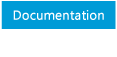
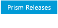

[Desktop Development](https://msdn.microsoft.com/en-us/library/ff921343.aspx "Desktop Development")[Prism](https://msdn.microsoft.com/en-us/library/ff648465.aspx "Prism")<a href="#" id="breadcrumbDropDownButton" title="Prism 5 - Developer&#39;s Guide to Microsoft Prism Library 5.0 for WPF">Prism 5 - Developer's Guide to Microsoft Prism Library 5.0 for WPF</a>

[Prism 5 - Developer's Guide to Microsoft Prism Library 5.0 for WPF](https://msdn.microsoft.com/en-us/library/gg406140.aspx "Prism 5 - Developer's Guide to Microsoft Prism Library 5.0 for WPF")<a href="#" id="tocDropDownButton" title="14: Upgrading from Prism Library 4.1">14: Upgrading from Prism Library 4.1</a>

<a href="#" id="tocPopupButton" title="14: Upgrading from Prism Library 4.1">14: Upgrading from Prism Library 4.1</a>

14: Upgrading from Prism Library 4.1

)

[Download and Setup Prism](https://msdn.microsoft.com/en-us/library/gg405471(v=pandp.40).aspx "Download and Setup Prism")

[What's New in Prism Library 5.0 for WPF](https://msdn.microsoft.com/en-us/library/gg430871(v=pandp.40).aspx "What's New in Prism Library 5.0 for WPF")

[Contents of the Developer's Guide to Prism](https://msdn.microsoft.com/en-us/library/gg430865(v=pandp.40).aspx "Contents of the Developer's Guide to Prism")

[1: Introduction](https://msdn.microsoft.com/en-us/library/ff921153(v=pandp.40).aspx "1: Introduction")

[2: Initializing Applications](https://msdn.microsoft.com/en-us/library/gg430868(v=pandp.40).aspx "2: Initializing Applications")

[3: Managing Dependencies Between Components](https://msdn.microsoft.com/en-us/library/ff921140(v=pandp.40).aspx "3: Managing Dependencies Between Components")

[4: Modular Application Development](https://msdn.microsoft.com/en-us/library/gg405479(v=pandp.40).aspx "4: Modular Application Development")

[5: Implementing the MVVM Pattern](https://msdn.microsoft.com/en-us/library/gg405484(v=pandp.40).aspx "5: Implementing the MVVM Pattern")

[6: Advanced MVVM Scenarios](https://msdn.microsoft.com/en-us/library/gg405494(v=pandp.40).aspx "6: Advanced MVVM Scenarios")

[7: Composing the User Interface](https://msdn.microsoft.com/en-us/library/ff921098(v=pandp.40).aspx "7: Composing the User Interface")

[8: Navigation](https://msdn.microsoft.com/en-us/library/gg430861(v=pandp.40).aspx "8: Navigation")

[9: Communicating Between Loosely Coupled Components](https://msdn.microsoft.com/en-us/library/ff921122(v=pandp.40).aspx "9: Communicating Between Loosely Coupled Components")

[10: Deploying Applications](https://msdn.microsoft.com/en-us/library/gg430856(v=pandp.40).aspx "10: Deploying Applications")

[11: Glossary for the Prism Library](https://msdn.microsoft.com/en-us/library/ff921135(v=pandp.40).aspx "11: Glossary for the Prism Library")

[12: Patterns in the Prism Library](https://msdn.microsoft.com/en-us/library/ff921146(v=pandp.40).aspx "12: Patterns in the Prism Library")

[13: Prism Library](https://msdn.microsoft.com/en-us/library/gg405476(v=pandp.40).aspx "13: Prism Library")

[14: Upgrading from Prism Library 4.1](https://msdn.microsoft.com/en-us/library/ff921144(v=pandp.40).aspx "14: Upgrading from Prism Library 4.1")

[15: Extending the Prism Library](https://msdn.microsoft.com/en-us/library/gg430866(v=pandp.40).aspx "15: Extending the Prism Library")

<a href="https://msdn.microsoft.com/en-us/library/gg430879(v=pandp.40).aspx" id="dn646931_PandP.40_en-us" title="16: Code Samples">16: Code Samples</a>

[17: Getting Started Hands-on Lab](https://msdn.microsoft.com/en-us/library/ff921141(v=pandp.40).aspx "17: Getting Started Hands-on Lab")

[18: Publishing and Updating Applications Hands-on Lab](https://msdn.microsoft.com/en-us/library/gg405497(v=pandp.40).aspx "18: Publishing and Updating Applications Hands-on Lab")

[Bibliography](https://msdn.microsoft.com/en-us/library/gg405487(v=pandp.40).aspx "Bibliography")

[Microsoft patterns & practices License](https://msdn.microsoft.com/en-us/library/gg405489(v=pandp.40).aspx "Microsoft patterns & practices License")

<a href="https://msdn.microsoft.com/en-us/library/dn736262(v=pandp.50).aspx" id="dn736311_PandP.50_en-us" title="Prism Class Library 5.0 for WPF">Prism Class Library 5.0 for WPF</a>

<a href="javascript:void(0)" id="tocMenuToggler"></a>
TOC

From: [Developer's Guide to Microsoft Prism Library 5.0 for WPF](https://msdn.microsoft.com/en-us/library/gg406140.aspx)

On this page
-   [ViewModel Namespace and API Changes](#sec1)
-   [EventAggregator Namespace and API Changes](#sec2)
-   [Regions Namespace API Changes](#sec3)
-   [Commands Assembly Changes](#sec4)
-   [Prism NuGet Packages](#sec5)

This topic describes how to upgrade a solution from version 4.1 to version 5.0 of the Prism Library and the major changes that you should be aware of if you are considering upgrading to the 5.0 version.

ViewModel Namespace and API Changes
----------------------------------------------------------

The classes in the **Microsoft.Practices.Prism.ViewModel** namespace were made obsolete but still exist in Prism 5.0. You should use the classes from the **Microsoft.Practices.Prism**.**Mvvm** portable class library with **Microsoft.Practices.Prism**.**Mvvm** namespace. The **BindableBase** class replaces the **NotificationObject** class. If you need to implement **INotifyPropertyChanged** event, you should now use **BindableBase**, and use the **SetProperty** method in the property setter, which verifies if the value actually changed and if so, sets the backing field and raises the **PropertyChanged** event.

The 4.1 code was as follows:

C\#

<a href="javascript:if%20(window.epx.codeSnippet)window.epx.codeSnippet.copyCode(&#39;CodeSnippetContainerCode_a4648546-9047-420d-b712-274505621fcd&#39;);" id="CodeSnippetCopyLink" title="Copy to clipboard.">Copy</a>

    this.RaisePropertyChanged(() => this.WatchListItems);

    . . .

    if (value != this.timeInForce)
    {
       this.timeInForce = value;
       this.RaisePropertyChanged(() => this.TimeInForce);
    }

The 5.0 code is as follows:

C\#

<a href="javascript:if%20(window.epx.codeSnippet)window.epx.codeSnippet.copyCode(&#39;CodeSnippetContainerCode_4f056467-a5cb-4168-b049-46f6d787be88&#39;);" id="CodeSnippetCopyLink" title="Copy to clipboard.">Copy</a>

    OnPropertyChanged(() => this.WatchListItems);

    . . . 

    SetProperty(refthis.timeInForce, value);

The Prism NuGet package will manage the changes to the new Prism assemblies.

If you decide to manually update your references, the **Microsoft.Practices.Prism.ViewModel** namespace now requires you to add the following references:

-   Microsoft.Practices.Prism.Mvvm
-   Microsoft.Practices.Prism.Mvvm.Desktop
-   Microsoft.Practices.Prism.ShareInterfaces

Alternatively you can add a NuGet reference to the Prism.Mvvm package if you only want the Prism.Mvvm APIs.

EventAggregator Namespace and API Changes
----------------------------------------------------------------

The classes in the Events namespace were made obsolete but still exist in Prism 5.0. You should use the classes from the **Prism**.**PubSubEvents** portable class library with the **Prism**.**PubSubEvents** namespace. The **PubSubEvent** class replaces the **CompositePresentationEvent** class.

The Prism NuGet package will manage the changes to the new Prism assemblies.

If you decide to manually update your references, you will now need to add a reference to the following:

-   **Microsoft.Practices.Prism.PubSubEvents**

Alternatively you can insert a NuGet reference to the Prism.PubSubEvents NuGet package if you only want the Prism.PubSubEvents APIs.

Regions Namespace API Changes
----------------------------------------------------

The **UriQuery** class was replaced with the **NavigationParameters** class and moved to the **Regions** namespace. Previous functionality remains the same, and support for object parameters was added. The **RequestNavigate** method defined in the interface **INavigateAsync** was updated to allow the passing of **NavigationParameters**.

Commands Assembly Changes
------------------------------------------------

The following classes from the **Commands** namespace were moved from the Prism library to the Prism.Mvvm portable class library:

-   **CompositeCommand**
-   **DelegateCommand**
-   **DelegateCommandBase**
-   **WeakEventHandlerManager**

For these classes you will only need to change your references to the Prism.Mvvm assembly.

The **CommandBehaviorBase** class was moved to the **Prism**.**Interactivity** namespace from the **Commands** namespace. The **ExecuteCommand** method now takes an object as a parameter.

The **ButtonBaseClickCommandBehavior** and **Click** classes were removed as they were obsolete last release.

Prism NuGet Packages
-------------------------------------------

The following signed Prism assemblies can now be referenced from NuGet:

-   [Prism 5.0](http://aka.ms/prism-wpf-Prism50Nuget)
-   [Prism.Composition 5.0](http://aka.ms/prism-wpf-Prism50CompositionNuget)
-   [Prism.Interactivity 5.0](http://aka.ms/prism-wpf-Prism50InteractivityNuget)
-   [Prism.PubSubEvents 1.0](http://aka.ms/prism-wpf-Prism50PubSubEventsNuget)
-   [Prism.Mvvm 1.0](http://aka.ms/prism-wpf-Prism50MvvmNuget)
-   [Prism.UnityExtensions 5.01](http://aka.ms/prism-wpf-Prism50UnityExtensionsNuget)
-   [Prism.MefExtensions 5.0](http://aka.ms/prism-wpf-Prism50MefExtensionsNuget)

The [Prism NuGet package](http://aka.ms/prism-wpf-Prism50Nuget) will download the Prism.Composition, Prism.PubSubEvents, Prism.Mvvm, and Prism.Interactivity NuGet packages.

[Next Topic](https://msdn.microsoft.com/en-us/library/gg430866(v=pandp.40)) | [Previous Topic](https://msdn.microsoft.com/en-us/library/gg405476(v=pandp.40)) | [Home](https://msdn.microsoft.com/en-us/library/gg406140) | [Community](https://compositewpf.codeplex.com/)

Show:Inherited Protected

Print
Export (0)

Print
Share

IN THIS ARTICLE

© 2017 Microsoft

Third party scripts and code linked to or referenced from this website are licensed to you by the parties that own such code, not by Microsoft. See ASP.NET Ajax CDN Terms of Use – http://www.asp.net/ajaxlibrary/CDN.ashx. WebTrends view model not available or IncludeLegacyWebTrendsScriptInGlobal feature flag is off
