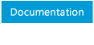

[Desktop Development](https://msdn.microsoft.com/en-us/library/ff921343.aspx "Desktop Development")[Prism](https://msdn.microsoft.com/en-us/library/ff648465.aspx "Prism")<a href="#" id="breadcrumbDropDownButton" title="Prism 5 - Developer&#39;s Guide to Microsoft Prism Library 5.0 for WPF">Prism 5 - Developer's Guide to Microsoft Prism Library 5.0 for WPF</a>

[Prism 5 - Developer's Guide to Microsoft Prism Library 5.0 for WPF](https://msdn.microsoft.com/en-us/library/gg406140.aspx "Prism 5 - Developer's Guide to Microsoft Prism Library 5.0 for WPF")<a href="#" id="tocDropDownButton" title="What&#39;s New in Prism Library 5.0 for WPF">What's New in Prism Library 5.0 for WPF</a>

<a href="#" id="tocPopupButton" title="What&#39;s New in Prism Library 5.0 for WPF">What's New in Prism Library 5.0 for WPF</a>

What's New in Prism Library 5.0 for WPF

)

[Download and Setup Prism](https://msdn.microsoft.com/en-us/library/gg405471(v=pandp.40).aspx "Download and Setup Prism")

[What's New in Prism Library 5.0 for WPF](https://msdn.microsoft.com/en-us/library/gg430871(v=pandp.40).aspx "What's New in Prism Library 5.0 for WPF")

[Contents of the Developer's Guide to Prism](https://msdn.microsoft.com/en-us/library/gg430865(v=pandp.40).aspx "Contents of the Developer's Guide to Prism")

[1: Introduction](https://msdn.microsoft.com/en-us/library/ff921153(v=pandp.40).aspx "1: Introduction")

[2: Initializing Applications](https://msdn.microsoft.com/en-us/library/gg430868(v=pandp.40).aspx "2: Initializing Applications")

[3: Managing Dependencies Between Components](https://msdn.microsoft.com/en-us/library/ff921140(v=pandp.40).aspx "3: Managing Dependencies Between Components")

[4: Modular Application Development](https://msdn.microsoft.com/en-us/library/gg405479(v=pandp.40).aspx "4: Modular Application Development")

[5: Implementing the MVVM Pattern](https://msdn.microsoft.com/en-us/library/gg405484(v=pandp.40).aspx "5: Implementing the MVVM Pattern")

[6: Advanced MVVM Scenarios](https://msdn.microsoft.com/en-us/library/gg405494(v=pandp.40).aspx "6: Advanced MVVM Scenarios")

[7: Composing the User Interface](https://msdn.microsoft.com/en-us/library/ff921098(v=pandp.40).aspx "7: Composing the User Interface")

[8: Navigation](https://msdn.microsoft.com/en-us/library/gg430861(v=pandp.40).aspx "8: Navigation")

[9: Communicating Between Loosely Coupled Components](https://msdn.microsoft.com/en-us/library/ff921122(v=pandp.40).aspx "9: Communicating Between Loosely Coupled Components")

[10: Deploying Applications](https://msdn.microsoft.com/en-us/library/gg430856(v=pandp.40).aspx "10: Deploying Applications")

[11: Glossary for the Prism Library](https://msdn.microsoft.com/en-us/library/ff921135(v=pandp.40).aspx "11: Glossary for the Prism Library")

[12: Patterns in the Prism Library](https://msdn.microsoft.com/en-us/library/ff921146(v=pandp.40).aspx "12: Patterns in the Prism Library")

[13: Prism Library](https://msdn.microsoft.com/en-us/library/gg405476(v=pandp.40).aspx "13: Prism Library")

[14: Upgrading from Prism Library 4.1](https://msdn.microsoft.com/en-us/library/ff921144(v=pandp.40).aspx "14: Upgrading from Prism Library 4.1")

[15: Extending the Prism Library](https://msdn.microsoft.com/en-us/library/gg430866(v=pandp.40).aspx "15: Extending the Prism Library")

<a href="https://msdn.microsoft.com/en-us/library/gg430879(v=pandp.40).aspx" id="dn646931_PandP.40_en-us" title="16: Code Samples">16: Code Samples</a>

[17: Getting Started Hands-on Lab](https://msdn.microsoft.com/en-us/library/ff921141(v=pandp.40).aspx "17: Getting Started Hands-on Lab")

[18: Publishing and Updating Applications Hands-on Lab](https://msdn.microsoft.com/en-us/library/gg405497(v=pandp.40).aspx "18: Publishing and Updating Applications Hands-on Lab")

[Bibliography](https://msdn.microsoft.com/en-us/library/gg405487(v=pandp.40).aspx "Bibliography")

[Microsoft patterns & practices License](https://msdn.microsoft.com/en-us/library/gg405489(v=pandp.40).aspx "Microsoft patterns & practices License")

<a href="https://msdn.microsoft.com/en-us/library/dn736262(v=pandp.50).aspx" id="dn736311_PandP.50_en-us" title="Prism Class Library 5.0 for WPF">Prism Class Library 5.0 for WPF</a>

<a href="javascript:void(0)" id="tocMenuToggler"></a>
TOC

From: [Developer's Guide to Microsoft Prism Library 5.0 for WPF](https://msdn.microsoft.com/en-us/library/gg406140.aspx)

On this page
-   [New Guidance](#sec1)
-   [Changes in the Prism Library](#sec2)
-   [Code Organization](#sec3)
-   [API Changes](#sec4)
-   *[MVVM and Event Aggregator Changes.](#sec5)*
-   *[Additions to the Prism Library Core API](#sec6)*
-   [CodePlex Issues Resolved](#sec7)
-   [Example Code Changes](#sec8)
-   [NuGet Packages Now Available](#sec9)
-   [More Information](#sec10)

Prism 5.0 includes guidance in several new areas, resulting in new code in the Prism Library for WPF, new and updated QuickStarts, and updated documentation. Parts of the Prism Library changed between Prism 4.1 and Prism 5.0 to support the new guidance, fix existing issues, and respond to community requests.

**Note:** For .NET 4.0, Silverlight, or Windows Phone 7.x applications use [Prism 4.1](https://msdn.microsoft.com/en-us/library/gg430869(v=pandp.40)).

New Guidance
===================================

Prism 5.0 contains several areas of new guidance as follows:

-   **Prism.Mvvm** is a portable class library that encapsulates Prism's MVVM support. This library includes **ViewModelLocationProvider**. Views and view models can be wired up together using the new **ViewModelLocationProvider**'s convention-based approach as explained in [Implementing the MVVM Pattern](https://msdn.microsoft.com/en-us/library/gg405484(v=pandp.40)). View model construction can be accomplished using a dependency injection container. The ViewModel Locator's extensibility points are discussed in [Extending the Prism Library](https://msdn.microsoft.com/en-us/library/gg430866(v=pandp.40)). **DelegateCommands** are now extendable and provide Async support. A new implementation of the **INotifyPropertyChanged** interface, the **BindabaleBase** class, was added.
-   **The PopupWindowAction** class was added to the **Prism.Interactivity** assembly to open a custom window in response to an interaction request being raised.
    The **InvokeCommandAction** action provided by Prism now passes trigger parameters to the associated command.
    For more information see [Advanced MVVM Scenarios](https://msdn.microsoft.com/en-us/library/gg405494(v=pandp.40)).
-   The **EventAggregator** classes have been moved to the **Prism.PubSubEvents** portable class library.
-   The **NavigationParameters** class can now be used to pass object parameters during navigation, using the overloads of the **RequestNavigate** method of a **Region** or **RegionManager** instance.

Changes in the Prism Library
===================================================

Prism Library 5.0 includes changes related to new functionality, code organization, and APIs.

Code Organization
----------------------------------------

The following organizational changes were made to the library:

-   The **Microsoft.Practices.Prism.PubSubEvents** portable class library contains **PubSubEvents**, **EventAggregator** and related classes.
-   The **Microsoft.Practices.Prism.Mvvm** portable class library contains **ViewModelLocationProvider**, **BindableBase**, **ErrorsContainer, PropertySupport, CompositeCommand, DelegateCommand, DelegateCommandBase, and WeakEventHandlerManager**.
-   The **Microsoft.Practices.Prism.Mvvm.Desktop** assembly contains the WPF **ViewModelLocator** attach property.
-   The **EventAggregator** classes are marked obsolete in the Prism assembly.
-   The Silverlight and phone versions of the Prism Library were taken out. If you need these libraries download the Prism 4.1 assemblies from NuGet.
-   Prism and **Prism.Mvvm** are independent of each other but share **IActiveAware**. Therefore **IActiveAware** has been moved to **Prism.SharedInterfaces**.

In version 5.0 of Prism, Pub Sub Eventing functionality was moved into a separate assembly (Prism.PubSubEvents). **DelegateCommand**, **CompositeCommand,** and **ViewModel** support were moved into another assembly (**Prism.Mvvm**). There are many advantages to separating **PubSubEvents** and **Mvvm** from the core Prism assembly.

-   You can select only the functionality that you need. If you want Regions and Modularity, you use the core Prism assembly. If you want only **ViewModel** and commanding support, you use Prism.Mvvm. If you only want Pub Sub Eventing, you use **Prism.PubSubEvents**. Each assembly is smaller and easier to understand.
-   You can now build your **ViewModel** code in a portable class library that leverages **Prism.Mvvm** and/or **Prism.PubSubEvents** since both are PCLs. By putting your **ViewModel** code in a PCL, your **ViewModel** code is constrained to using dependent libraries that are platform agnostic and thus can target multiple platforms.
-   Updates to these smaller libraries can be made more easily and quickly.

API Changes
----------------------------------

The Prism Library API changed in several key areas. The bootstrapper was heavily modified and reusable code was added to support the new areas of guidance provided in Prism.

### MVVM and Event Aggregator Changes.

Moving **ViewModel** and **EventAggregator** to a PCL causes several changes to the Prism Library. These changes include the following:

-   The **BindableBase** class in **Prism**.**Mvvm** should be used instead of **NotifcationObject**. The **NotificationObject** and **PropertySupport** classes are marked obsolete in the Prism assembly.
-   When inheriting from the **BindableBase** class, use the **SetProperty** method to update the property's backing field and raise the corresponding property change event. A new **OnPropertyChanged** method that takes a lambda expression as a parameter has been added.
-   Use the **PubSubEvents** class in the **Microsoft**.**Practices**.**PubSubEvents** portable class library instead of **CompositePresentationEvents**. The classes from the Events solution folder in the Prism assembly are marked obsolete.
-   The **UriQuery** class was renamed to **NavigationParameters**, it keeps the same functionality as before, and adds support for passing object parameters.
-   **DelegateCommand** includes support for async handlers and has been moved to the **Prism.Mvvm** portable class library. **DelegateCommand** and **CompositeCommand** both use the **WeakEventHandlerManager** to raise the **CanExecuteChanged** event. The **WeakEventHandlerManager** must be first constructed on the UI thread to properly acquire a reference to the UI thread's **SynchronizationContext**.
-   **EventAggregator** now must be constructed on the UI thread to properly acquire a reference to the UI thread's **SynchronizationContext**.
-   The **WeakEventHandlerManager is now** public.
-   The **Execute** and **CanExecute** methods on **DelegateCommand** are now marked as virtual.

### Additions to the Prism Library Core API

The following namespaces were added to the Prism Library to support the new areas of guidance added in Prism 5.0:

-   **Microsoft.Practices.Prism.PubSubEvents** was added to help you send loosely coupled message using a portable class library.
-   **Microsoft.Practices.Prism.Mvvm** was added to assist you in implementing MVVM using a portable class library and several platform specific libraries.
-   **Microsoft.Practices.Prism.SharedInterfaces** has been added to share the **IActiveAware** interface between **Prism** and **Prism.Mvvm** assemblies, therefore the **IActiveAware** interface has been moved to this assembly. It is also intended for future use.

CodePlex Issues Resolved
===============================================

-   **8532: InteractionRequestTrigger** can cause memory leaks with some implementations.
-   **9153:** 'Notification' really should be an interface.
-   **9438:** Navigation to an existing view.
-   **5495:** Event to Command.
-   **8101: DelegateCommand** is not extendable.
-   **5623:** Make **WeakEventHandlerManager** public.
-   **9906**: A bug when using XAML module catalog in WPF.
-   **7215:** Issue with ModuleCatalog.CreateFromXaml for WPF application with MEF Bootstrapper.
-   **8703:** RegionManager::IsInDesignMode.
-   **4349:** Default Region Behavior Order Problem.
-   **3552:** Region manager in V2 fails to recognize non-WPF applications.

Example Code Changes
===========================================

Prism 5.0 contains eleven separate code samples that demonstrate portions of the provided guidance. Several samples from Prism 4.1 were removed or replaced, and new samples added.

The following samples were added for Prism 5.0:

-   **Basic MVVM QuickStart**. This QuickStart shows a very simple MVVM application that uses the **ViewModel** Locator and show a parent and child **ViewModels**. For more information, see the MVVM QuickStart**.**
-   **MVVM QuickStart**. This QuickStart was removed for this version.
-   **MVVM Reference Implementation**. This reference implementation was removed for this version.
-   **View-Switching Navigation QuickStart**. This QuickStart now supports WPF. It demonstrates how to use the Prism region navigation API. For more information, see [View-Switching Navigation QuickStart](https://msdn.microsoft.com/en-us/library/gg430881(v=pandp.40)).
-   **State-Based Navigation QuickStart**. This QuickStart now supports WPF. It shows an approach that uses the Visual State Manager to define the views (states) and the allowed transitions. For more information, see [State-Based Navigation QuickStart](https://msdn.microsoft.com/en-us/library/gg405495(v=pandp.40)).
-   **UI Composition QuickStart**. This QuickStart now supports WPF. It replaced the View Injection QuickStart and the View Discovery QuickStart from Prism 2.0. In the current versions, both concepts are shown in one example application. For more information, see [UI Composition QuickStart](https://msdn.microsoft.com/en-us/library/ff921174(v=pandp.40)).
-   **Interactivity QuickStart**. This new QuickStart demonstrates how to exposes an interaction request to the view through the view model. The interactions can be a popup, confirmation, custom popup, and a more complex case where the popup needs a custom view model. It also shows Prism's **InvokeCommandAction** action that passes the **EventArgs** from the trigger, as a command parameter. For more infromation, see [Interactivity QuickStart](https://msdn.microsoft.com/en-us/library/ff921081(v=pandp.40)).

NuGet Packages Now Available
===================================================

In your application, you can now use NuGet to add references to the Prism assemblies. These packages include:

-   [Prism](http://aka.ms/prism-wpf-Prism50Nuget)
-   [Prism.Composition](http://aka.ms/prism-wpf-Prism50CompositionNuget)
-   [Prism.Interactivity](http://aka.ms/prism-wpf-Prism50InteractivityNuget)
-   [Prism.Mvvm](http://aka.ms/prism-wpf-Prism50MvvmNuget)
-   [Prism.PubSubEvents](http://aka.ms/prism-wpf-Prism50PubSubEventsNuget)
-   [Prism.UnityExtensions](http://aka.ms/prism-wpf-Prism50UnityExtensionsNuget)
-   [Prism.MEFExtensions](http://aka.ms/prism-wpf-Prism50MefExtensionsNuget)

| Note:                                                                         |
|--------------------------------------------------------------------------------------------------------------------------------------------------------------------------------------------------------------------------------------------------------------|
| The Prism NuGet package will download the Prism.Composition, Prism.Interactivity, Prism.Mvvm, and Prism.PubSubEvents packages. You only need to add references to the Prism.Interactivity, Prism.Mvvm, and Prism.PubSubEvents if you need finer granularity. |

More Information
========================================

For more information about how to upgrade a solution from version 4.1 to version 5.0 of the Prism Library, see [Upgrading from Prism Library 4.1](https://msdn.microsoft.com/en-us/library/ff921144(v=pandp.40)).

[Next Topic](https://msdn.microsoft.com/en-us/library/gg430865(v=pandp.40)) | [Previous Topic](https://msdn.microsoft.com/en-us/library/gg405471(v=pandp.40)) | [Home](https://msdn.microsoft.com/en-us/library/gg406140) | [Community](https://compositewpf.codeplex.com/)

Show:Inherited Protected

Print
Export (0)

Print
Share

IN THIS ARTICLE

© 2017 Microsoft

Third party scripts and code linked to or referenced from this website are licensed to you by the parties that own such code, not by Microsoft. See ASP.NET Ajax CDN Terms of Use – http://www.asp.net/ajaxlibrary/CDN.ashx. WebTrends view model not available or IncludeLegacyWebTrendsScriptInGlobal feature flag is off
